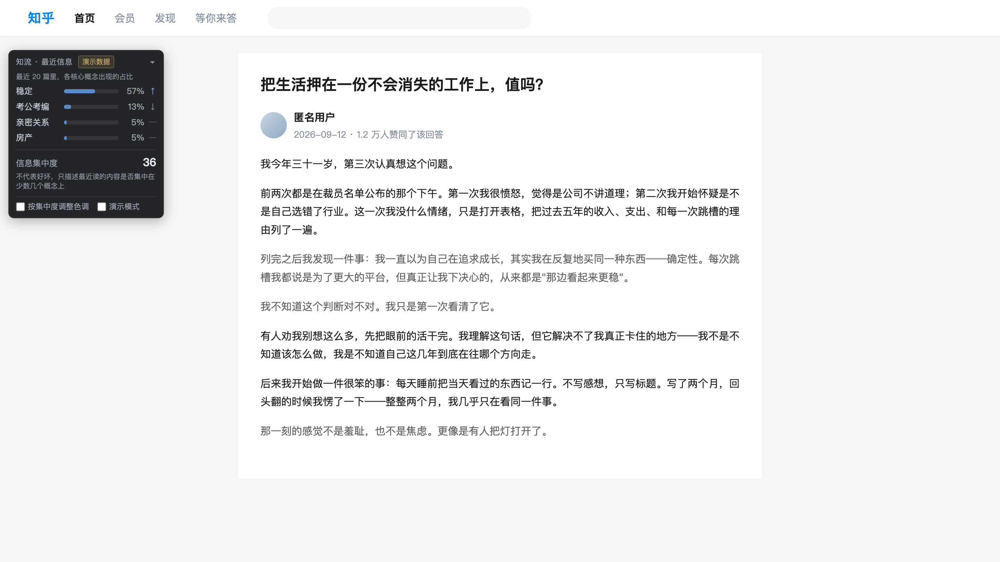

# 知流 · Zhihu Information Observability

> **推荐算法知道你最近在看什么，但你自己知道吗？**
>
> 我们不改变你的知乎信息流，只把你的信息流变得可见。

> 知流是信息流的**仪表盘**，不是第二个推荐算法。

知乎黑客松 2026 · 校园新锐季 ｜ 赛道：**灵魂匹配局**

**[▸ 作品链接 zhiliu-analyze.vercel.app](https://zhiliu-analyze.vercel.app/)** ·
[下载扩展](https://zhiliu-analyze.vercel.app/zhiliu-production.zip) ·
[分析服务健康检查](https://zhiliu-analyze.vercel.app/api/analyze)



<sup>面板是扩展的真实构建产物，数字是演示语料跑完整条聚合链路的真实输出，
「演示数据」标记是面板自己打的。背景那一页是按知乎版式在本地还原的页面，
不是 zhihu.com 的抓图——这张图由自动化流程生成，而知乎不允许自动化抓取。</sup>

## 装上试试

```bash
# 1. 下载并解压 https://zhiliu-analyze.vercel.app/zhiliu-production.zip
#    （仓库里也有一份：release/zhiliu-production.zip，两者 SHA-256 一致）
# 2. chrome://extensions → 开启「开发者模式」→「加载已解压的扩展程序」→ 选解压出来的目录
# 3. 打开任意知乎回答页，读够 8 秒
```

| 包 | 面板显示 | 说明 |
|---|---|---|
| `release/zhiliu-production.zip` | **AI 分析** | 连公网服务 `https://zhiliu-analyze.vercel.app/api/analyze` → 知乎官方直答 |
| `release/zhiliu-demo.zip` | **演示数据** | 不连任何服务，走本地确定性数据。看形态用，不是实时分析 |

自己打包：`ZHILIU_ANALYZE_ENDPOINT=https://…/analyze node scripts/package-release.mjs`

> 📌 **对外说的每一句话都登记在 [`docs/CLAIM_EVIDENCE.md`](docs/CLAIM_EVIDENCE.md)。**
> 规则只有一条：**claim 的 scope 不得超过 evidence 的 scope。**
> 门禁：`npm run release-check`（失败非零退出）。
>
> 提交材料：[产品说明计划书](docs/SUBMISSION_PRODUCT_PLAN.md) ·
> [提交清单](docs/SUBMISSION_CHECKLIST.md) · [部署说明](docs/DEPLOY_BACKEND.md)

---

## 这是什么

在知乎**正文左侧那条空白 gutter** 里放一个很小的面板。你正常刷知乎，
系统被动记录你**真正读过**的内容，对每篇提炼 1–3 个核心思想，持续展示：

```
知流 · 最近信息                        [演示数据]
最近 20 篇里，各核心概念出现的占比

稳定        ██████████  57% ↑
考公考编    ██          13% ↓
亲密关系    █            5% —
房产        █            5% —

信息集中度                              36
不代表好坏，只描述最近读的内容是否集中在少数几个概念上
```

<sup>上面这组数字不是手编的示例：它是演示语料跑完整条聚合链路的真实输出，
用 `node extension/dev/demo-trace.ts` 可以复现。</sup>

折叠后只剩一行：`知流 · 信息集中度 36`。

## 它不做什么

不改推荐流 · 不反推荐 · 不告诉你该看什么 · 不做认知偏差诊断 ·
不把高集中度诊断成「信息茧房」 · 不做 K 线持仓等金融隐喻 · 不为展示 Agent 而堆 Agent。

**集中度不代表好坏。** 高不等于被困住，低不等于视野开阔——它只是
「从最近读到的内容里随机抽两次，抽到同一个概念的概率」。

---

## 真正的技术核心：判对中心思想

面板不难。难的是这个：

> **怎么知道一篇知乎内容真正的核心思想是什么？**

一篇讲相亲经历的回答，可能反复出现「女性 / 男性 / 约会 / 外貌」。
朴素系统归到**性别议题**。但作者真正在讲的是**社交焦虑 / 负面评价恐惧**。

这个错误会沿链路放大：

```
概念判错 → 占比错 → 趋势错 → 集中度错 → 整个面板不可信
```

### 链路

```
Article
  ↓  候选召回（表层线索词，高召回，不做判定）
Candidate Concepts  ×3–5
  ↓  对每个候选调用官方 zhihu_search，取回它在知乎社区的实际讨论语料
Zhihu Semantic Neighborhoods
  ↓  跨邻域 IDF：只有"少数邻域才有的词"才有判别力
Adjudication（允许 ambiguous / unknown）
  ↓  canonical 合并
Final Concepts  ×1–3
```

### 机制一句话

```
df(t) = 含有词 t 的候选邻域数量
w(t)  = ln(m / df(t))          m = 候选数
```

- 「女性 / 约会 / 外貌」在**性别议题**和**社交焦虑**两个邻域里都高频 → `df` 高 → **权重归零**
- 「紧张 / 回避 / 心跳 / 事后回放」只在社交焦虑邻域高频 → **成为决定性证据**

> **判别用的词表不是模型先验，也不是我们写死的规则，
> 而是查询时从知乎语料现算出来的。**
>
> 我们从没写过"女性这个词不能用来判断性别议题"。
> 是知乎语料自己告诉我们：这个词在两类讨论里同样常见，所以它没有区分力。

完整推导见 [`docs/GROUNDING_MECHANISM.md`](docs/GROUNDING_MECHANISM.md)。

### ⚠️ 两轮评测把这套设想修正了两次

**第一轮**（30 条 DEV 集）：把知乎语料当**判别器**——算原文与候选语义邻域的
分布相似度，谁高选谁。结果：在 LLM 之上重排，**修对 1 条、改坏 12 条**。
原因是字符 bigram 的分布相似度不理解句子，赢不了语言理解。

**第二轮**（100 条盲测集）：改成知乎语料
**只提供证据、判断仍由 LLM 做**。结果：

> ⚠️ **下表里的数字全部来自一个 Claude 实验分类器（Claude-based experimental classifier），
> 不是知流当前出货产品的准确率。** 出货产品跑的是**知乎官方直答**（`zhida-fast-1p5`），
> 语料、评分口径、模型三者都不同，**两组数字不可互换引用**。
> 产品自己的模型选型结果在 [`docs/MODEL_SELECTION.md`](docs/MODEL_SELECTION.md)。

```
                     严格primary   重大误分类   对抗题(20)    ECE
Baseline A 关键词      0.250        0.295       17/20      0.265
C0  Claude 实验分类器   0.889        0           20/20      0.128
C1  +标题             0.926        0           20/20      0.135
C2  +标题+摘要         0.914        0           20/20      0.118
C3  +完整知乎证据       0.877        0           20/20      0.090
```

配对 McNemar 检验：**六组两两比较全部不显著**（p 从 0.125 到 1.000）。

| 主张 | 结论 |
| :- | :- |
| 关键词方法会系统性误判 | ✅ 成立（重大误分类 0.295 vs 0） |
| 知乎证据提升判断准确率 | ❌ **未能证明** |
| AI 会被表层关键词带偏 | ❌ **被证伪**：LLM-only 在 20 条专门设计的对抗题上 20/20 |
| 证据越多越好 | ❌ **方向相反**：只给标题优于完整证据 |
| 知乎证据改善校准 | ✅ 小幅成立：ECE 0.128 → 0.090 |

**根本原因是没有 headroom。** LLM-only 的重大误分类率已经是 0——
我们造不出能骗过它的样本，也就无从证明证据有用。
项目最初用来立项的失败模式（「AI 会把社交焦虑判成性别议题」）
**在真实的 LLM 上观察不到**。

因此知乎 API 的定位按证据收敛为：

> **可解释性与溯源层**——面板能给出"为什么判成这个概念"，
> 并附上知乎社区里真实的同类讨论。这是产品能力，不是准确率能力。
> 附带一点校准与不确定性识别上的小幅收益。

**不再宣称**：知乎 API 能纠正 AI 的语义误判。

---

## 官方 API 使用

依据官方 Skill 包 `zhihu/references/http-api.md`，**2026-09-13 真实调用核验**
（4 次查询全 `Code:0`，字段与 `types.ts` 逐字段对得上）。详见 [`docs/API_LIVE_20260913.md`](docs/API_LIVE_20260913.md)。

`GET https://developer.zhihu.com/api/v1/content/zhihu_search`

| 字段 | 使用 | 用途 |
| :- | :- | :- |
| `Title` | ✅ ×3 权重 | 知乎标题常就是问题本身，信息密度最高 |
| `ContentText` | ✅ | 邻域词汇分布的主要来源 |
| `RankingScore` | ✅ | 官方相关性排序分，用于邻域加权 |
| `CommentInfoList` | ✅ 低权重 | 精选评论含社区口语（"社恐""上岸"） |
| `AuthorityLevel` | ❌ 刻意不用 | 衡量作者权威度，与"讲什么"无关。实测 Top-5 里只出 `"3"`/`"4"`，且是 string |
| `VoteUpCount` / `CommentCount` | ❌ 刻意不用 | 热度不等于语义代表性 |

**额度**：`zhihu-cli quota` **实测** `zhihu_search` **5,000 次/日**（官方文档写的默认值是 100，以 `quota` 返回为准；仓库此前记的 1,000 是按"保守取值"猜的，已作废）。
但真正会咬人的不是日额度，是**瞬时限速**：实测背靠背打十几次就开始 `429`，而 429 不扣额度。
候选概念来自固定的 31 个 canonical 注册表，所以搜索 query 取值空间**有界**；
配合 24h 缓存，稳态下每天上游调用量上限 ≈ **概念数（31）而非文章数**。

---

## 隐私边界

> **长期阅读画像与跨页面聚合只保存在本地；服务端不接收任何用户状态。**

| | 存在哪 |
| :- | :- |
| 阅读历史 / 概念历史 / 趋势 / 集中度 / 设置 | **浏览器本地**（chrome.storage.local，上限 100 条） |
| 当前这一篇公开内容的语义分析 | 服务端（无状态，不建库，不持久化正文，不做跨请求画像） |
| Access Secret | **只在服务端环境变量**，绝不进扩展包 |

请求体有**强制字段白名单**：只允许 `contentId` / `contentType` / `title` / `text`，
出现任何多余字段一律 400 拒绝。这不是约定，是一条会失败的约束——
`userId`、`sessionId`、`history`、`previousConcepts`、`concentration`、完整 `url`
在物理上传不过去（见 `packages/extension-test/privacy.test.ts` 的 12 条断言）。
注意 `contentId` 是**内容**的公开标识，不是**用户**的标识。

### 做不到的部分（红队指出后改写）

逐篇请求仍然会到达服务端。**同一来源 IP 的请求序列加上到达时间，
在网络层理论上仍可被重建成阅读轨迹**——代码层面阻止不了这件事。

因此本项目**不宣称**"服务器技术上绝对无法推断任何阅读轨迹"。
要把这条从承诺变成架构保证，需要把裁决下沉到客户端、服务端只每日下发语料包，
那是下一步的架构工作，目前**没有**做到。

---

## 信息集中度

从最近 20 篇的概念分布算 Simpson 指数（各占比的平方和），乘 100 取整：

```
C = Σ pᵢ²        pᵢ = 第 i 个概念在窗口里的占比
```

直观读法：**从最近读到的内容里随机抽两次，抽到同一个概念的概率。**
它不代表好坏 —— 高可能是你在认真研究一件事，也可能是你被困住了，
知流不知道，也不假装知道。

两条硬约束：

- **每篇文章总权重恒为 1**，再平分给它的概念。否则"被提取出 3 个概念的文章"
  会获得 3 倍影响，而概念数量只反映模型的犹豫程度，不反映阅读量。
- **样本 < 10 篇不出分**（`MIN_SAMPLES`），只显示「数据积累中 · 已记录 N/10 篇」。
  这个数字和面板上的分母是同一个来源，不许两边各写各的。

它**只**描述"最近接触的信息有多集中"。不诊断茧房、不归因算法、不判断好坏——
高集中度同样可能只是你正在系统性地学一个主题。面板配色因此只在同一冷色系内位移，
**不用绿=健康红=危险的交通灯**。

---

## 目录结构

```
zhiliu/
├── packages/core/          零依赖核心引擎（TypeScript，Node 原生类型擦除运行）
│   ├── src/
│   │   ├── model.ts        ReadEvent / ConceptAggregate（只存在于浏览器本地）
│   │   ├── extract.ts      LLM-only 抽取契约：schema 校验、拒绝凑数、允许 unknown
│   │   ├── canonicalize.ts 概念归一四级：exact → alias → LLM → fuzzy  ← 面板不碎裂的关键
│   │   ├── aggregate.ts    本地聚合 + 趋势（最近 10 篇 vs 前 10 篇，阈值 ±40pp）
│   │   ├── concentration.ts Simpson 集中度（固定 20 篇窗口，<10 篇不出分）
│   │   ├── registry.ts     31 个 canonical concept + aliases
│   │   ├── zhihu-client.ts 官方搜索客户端（扩展侧 flag 默认关闭——凭证只在服务端）
│   │   ├── evidence.ts     知乎证据 bundle（供解释与溯源，不参与判定）
│   │   └── grounding.ts    早期的分布相似度判别器（已退出主链路，保留供复现）
│   ├── providers.ts        ExtractorProvider：ollama / openai_compatible / zhida（**zhida 是服务端默认**）
│   └── test/               96 个测试
├── extension/              Chrome MV3 扩展
│   ├── src/content/        页面识别 / 正文抽取 / 有效阅读计时 / 七态 Dashboard
│   ├── src/background/     存储 / 分析调度 / 演示模式
│   ├── src/shared/         配置与 feature flags / 演示数据
│   ├── dev/                面板状态总览、色调对比、演示剧本追踪
│   └── build.mjs           零依赖构建（node 内置 stripTypeScriptTypes）
├── server/                 无状态 /analyze + 真实 API 契约探针
├── bench/                  dev（已冻结）/ blind（100 条盲测）/ systemc（实验链路）
└── docs/                   PRD / 架构 / 机制 / 评委问答 / 红队报告
```

---

## 运行

### 测试

```bash
node --test packages/core/test/*.test.ts packages/extension-test/*.test.ts
```

### 扩展

```bash
cd extension && node build.mjs
```

然后在 `chrome://extensions` 开启开发者模式 →「加载已解压的扩展程序」→ 选择 `extension/dist`。

### 演示模式（**无需任何 API 权限**）

面板展开后勾选「演示模式」，会用 26 篇预置样例逐条推进，可以看到：

```
信息集中度   10 ──────────────→ 36

最终面板（最近 20 篇 = 第 7–26 篇）：
  稳定       57% ↑     ← 从缺席涨上来，面板上最长的一根
  考公考编   13% ↓
  亲密关系    5% —
  房产        5% —
```

> `AI` 只出现在第 1 篇里，而窗口是最近 20 篇（第 7–26 篇）——
> 所以它**根本不在最终面板上**。这正是固定窗口该有的行为：
> 早期读过但最近没再碰的主题会自然滑出去。

每一条演示记录都带 `analysisStatus: 'demo'`，面板会打上琥珀色「演示数据」标记。

命令行追踪剧本每一步：

```bash
node extension/dev/demo-trace.ts
```

### 面板状态总览 / 色调对比

```bash
cd extension && python3 -m http.server 8731
# http://127.0.0.1:8731/dev/states.html   八种状态并排
# http://127.0.0.1:8731/dev/tint.html     集中度色调对比
```

### 用真实模型跑

**最短的一条路：装 `zhiliu-production.zip`**（[下载](https://zhiliu-analyze.vercel.app/zhiliu-production.zip)）。
它在打包时烧进了公网端点，装上就连着知乎官方直答，面板显示「AI 分析」——
不需要起任何本地服务。

> **仓库源码**里 `CONFIG.ANALYZE_ENDPOINT` 恒为空字符串，这是发布门禁强制的
> （空 = 走本地演示数据 + 打「演示数据」标记）。端点只在 `package-release.mjs`
> 打包那一刻注入到 `dist`，**绝不回写 src**。所以"源码里是空的"和
> "production 包连着后端"两句话同时为真，不矛盾。

---

下面这条是**自己跑一套后端**时用的（PROFILE B，本地 Ollama）。
它只在你自己的机器上成立，别人够不到，所以是 DEV-ONLY：

```bash
# 1. 起本地模型
ollama serve &
ollama pull qwen2.5:14b       # 只是**降级预案**（PROFILE B）。生产默认已改成知乎官方直答，见 docs/API_LIVE_20260913.md

# 2. 起分析服务
node server/dev-server.ts     # 输出会打印 provider/model

# 3. 让扩展指向它：把 extension/src/shared/config.ts 的
#    ANALYZE_ENDPOINT 改成 'http://127.0.0.1:8732/analyze'，然后重新 build
cd extension && node build.mjs
```

接上之后面板徽标会从「演示数据」变成「AI 分析」。
**如果徽标还是「演示数据」，说明没接上**——这个标记就是用来防止误判的。

服务端返回的每条结果都带 `provenance{provider, model, latencyMs}`；
扩展只有在拿到 provenance 时才认作 `llm`，否则降级为 `ungrounded`。
一个返回常量 JSON 的假服务器无法让面板显示「AI 分析」。

### 后端（可选）

```bash
node server/dev-server.ts                       # 无 secret 时自动走离线语料并标注
ZHIHU_ACCESS_SECRET=xxx node server/api-probe.ts # 真实 API 契约探针
```

---

## Feature flag

```ts
FLAGS.ZHIHU_SEARCH_ENABLED = false   // 默认关闭
```

100 条盲测显示知乎 Search 证据带不来可检测的准确率增益（McNemar p 0.125–1.000），
因此**主链路不依赖它**。拿到 API 权限后置为 `true` 即可启用「概念解释 / 相关知乎讨论溯源」，
主产品不需要重构。

---

## 发布相关文档

| 文档 | 用途 |
|---|---|
| [`docs/CLAIM_EVIDENCE.md`](docs/CLAIM_EVIDENCE.md) | **对外说话的唯一授权来源**：每条 claim 的证据等级与 scope |
| [`docs/HACKATHON_RUNBOOK.md`](docs/HACKATHON_RUNBOOK.md) | 演示前 10 分钟照着做（预热那步不能省） |
| [`docs/DEMO_SCRIPT.md`](docs/DEMO_SCRIPT.md) | 三分钟主线 + 被问到时怎么答 |
| [`docs/REAL_PAGE_TEST.md`](docs/REAL_PAGE_TEST.md) | 真人 Field Test 原始记录 |
| `npm run release-check` | 发布门禁，挡已知的 overclaim |

## 当前状态与诚实边界

> 这个公开快照**不含**内部过程材料：100 条盲测的逐条记录、九轮红队报告、
> 模型选型的原始 run、以及协作用的 handoff 文档都留在私有工作仓库里。
> 它们的**结论**都已经写进 [`docs/CLAIM_EVIDENCE.md`](docs/CLAIM_EVIDENCE.md)
> 和下面这一节 —— 那份登记表才是对外说话的授权来源。

### 已经能跑的

- Chrome MV3 扩展可构建、可加载，面板七种状态全部可演示
- 有效阅读判定通过 17 项边界测试（快速退出 / 后台挂机 / SPA 跳转 / 前进后退 / 多标签页 / 页面关闭补记 / 非内容页）
- 概念归一 16 项测试（同义合并 / 网络缩写 / 多义报 ambiguous / 禁止误合并 / 表外词不硬塞）
- 本地聚合、集中度、趋势 14 项测试，含红队反例回归
- **正文抽取 16 项测试**（三层策略 / 噪声容器剥离 / 多回答问题页 / 结构化截断 / 第三层 fail loud）
- **并发与乱序 7 项测试**（不阻塞 / 乱序回填 / 迟到结果丢弃 / 同篇不重复分析 / 孤儿占位回收）
- **真实端到端 2 项**（无 mock，服务不可用时整体 skip 而不是伪造）
- **真实结构回归 37 项**——fixture 的**结构**照搬真人 Field Test 的三个样本，但它们仍是 synthetic（L2）：证明“抽取逻辑对这种结构是对的”，**不证明**“知乎现在就是这种结构”
- **面板布局 25 项**（含"满宽 wrapper 必须被拒""不得拿正文内边距制造虚假 gutter"）（逐像素扫描 0–1600px；量不到时 fail closed；探针取全局最小值；
  以及"1440 桌面 gutter 只有 174px"这条在真实浏览器里量到的回归）。
  **注意逐像素扫描只覆盖纯函数**——真正守住"不压正文"的是渲染之后的运行时自检
  （`#enforceNoOverlap`），因为 CSS 能把算出来的宽度整个甩掉
- 离线套件跑一条命令就行：
  ```bash
  npm test              # 离线全量（当前 301 项，不连任何网络）
  npm run test:live     # 真连上游：live-zhida（直答+搜索）/ live-e2e / live-llm
  ```
  分开跑是因为 live 那三个会真的打上游：`live-zhida` 打知乎官方 API、
  `live-e2e` 需要分析服务在跑、`live-llm` 需要本地 ollama（没有就整体 skip）。
  发布前用 `ZHILIU_REQUIRE_LIVE=1 npm run test:live` —— 那个模式下 skip 即 fail，
  免得"全跳过"被读成"全通过"。
- **演示模式完全离线可跑**，剧本效果有回归测试守着

### 仍然是 mock / 未验证的

| 项 | 状态 |
| :- | :- |
| **概念抽取** | ✅ **已接入真实模型**。**生产默认 = 知乎官方直答**（`zhida-fast-1p5`，2026-09-13 真实跑通，p50 2.2s，本机 0 内存）；本地 `qwen2.5:14b` 降为降级预案，三模型对照见 [`docs/MODEL_SELECTION.md`](docs/MODEL_SELECTION.md)。**注意主分高不等于没有多余标签**：14B 在单主题文章上仍会凑第二个概念，判决原文里能搜到「凑数」。扩展未配置 `ANALYZE_ENDPOINT` 时仍走本地 mock 并标记 `status:'mock'`，面板显示「演示数据」；服务端未注入模型时返回 503 `llm_not_configured` |
| **知乎 Search API** | ✅ **2026-09-13 真实调用过**（4 次查询，`Code:0`，0.67–0.97s）。真实字段与脱敏样本见 [`docs/API_LIVE_20260913.md`](docs/API_LIVE_20260913.md) 与 `fixtures/live/`。**但它没有进分析主链路**——实测它不提高分类准确率，只能做「为什么归到这个主题」的语境展示，而且 5 个概念词里有 1 个会串台 |
| **知乎官方 AI（直答）** | ✅ **2026-09-13 真实调用过，且已是生产默认**。endpoint / 三个模型名 / OpenAI 响应形状全部实测 VERIFIED；29 条冻结验收集全量跑通，schema 29/29。**注意两点**：① 这套盲评**测不出**两者的质量差别——同一份 14B 输出被三个独立判官打出 1.83 / 1.66 / 1.48，判官间极差 0.34 比系统间差（0.10–0.17）还大，所以**不是**「官方模型更准」<!-- gate:allow F-12 本句的作用就是否认这个说法 -->，换它的理由是延迟过 Gate 而本地模型没过、且本机 0 内存；② 扩展侧 `ZHIHU_AI_ENABLED` 仍然是 `false`，官方能力**只在服务端调用**，凭证永不进扩展 |
| **知乎 DOM 抽取** | ✅ 回答页与专栏文章页均已 **MANUAL RE-VERIFIED PASS**（2026-09-10，**L4**）。见 [`docs/REAL_PAGE_TEST.md`](docs/REAL_PAGE_TEST.md)、[`docs/CLAIM_EVIDENCE.md`](docs/CLAIM_EVIDENCE.md) C-01 / C-02 |
| **面板布局** | ✅ **回答页 @ 1450 真人验证 PASS**（2026-09-10，**L4**）：`protectedContentLeft 209` / `renderedRight 197` / `margin 12` / `overlaps false`。**scope 仅此**——文章页布局与其它视口宽度仍是 L2，见 `CLAIM_EVIDENCE.md` U-02 / U-03 |
| **正式支持的页面** | 只有 `answer` 与 `article`。首页 feed / 热榜 / 搜索 / 个人页 / 不带 `/answer/` 的问题页 / 专栏广场等 **设计为 fail closed**：不抽取、不分析、不入库。⚠️ `/column-square` 的 bug 是真人发现的（L4），但**修复只有 synthetic 测试覆盖（L2），没有真人在真实列表页复验过** |
| **面板 gutter 布局细节** | 三层：正确测量 → 计算布局 → **渲染后拿真实矩形再断言**。**不是"常驻"**：量不到阅读列、或 gutter 放不下胶囊时面板会**隐藏**——「不遮挡正文」优先于「一直看得见」 |
| **多主题抽取** | 只有 `qwen2.5:14b` 做得到（验收集 6/6）。`7b` 是 **0/6**、`3b` 是 1/6。换小模型就会退化成单主题 |
| **问题页多回答** | 不带 `/answer/<id>` 的问题页一律判 `unknown`，不入库；带 `/answer/` 时根容器收缩到当前回答（有测试）。真实页面上是否成立仍待人工验证 |
| **验收集语料** | 29 条是**作者手写的合成知乎风格文本**，不是抓来的真实内容。它衡量语义能力，不替代真实页面测试 |

### 指标定义（第四轮重写）

**信息集中度 = Simpson 指数**

```
C = Σ pᵢ²          pᵢ = 概念 i 在窗口内的暴露占比
score = round(100 × C)
```

含义可以直接讲给用户听：**从最近读到的内容里随机抽两次，抽到同一个概念的概率**。
100 = 全都在讲同一件事；25 ≈ 均匀读四个主题。

旧的归一化熵有致命的样本量依赖（行为不变的读者 n=5 中位 43、n=20 约 21，
分数腰斩却与内容无关）。**真正让分数可比的不是换公式，而是固定窗口**——
任何基于经验分布的集中度都有有限样本偏差。因此：

| 样本数 | 行为 |
| :- | :- |
| < 10 篇 | 不出分，显示「数据积累中」 |
| 10–19 篇 | 出分但标记为**初步**，不与正式分数横向比较 |
| ≥ 20 篇 | 正式分数（窗口固定 20） |

Simpson 相对熵还多一个好处：**样本复制不变性**——同一分布的样本量翻倍，
分数严格不变。17 条性质测试覆盖规格要求的 A–G 全部七条。

**趋势 = 文章出现率**

某概念在**最近 10 篇** vs **再前 10 篇**中出现的**篇数比例**之差，阈值 **±40 个百分点**。

> 段长与阈值不是拍的：段长 5 + 阈值 ±20pp 时，真实行为完全不变的读者仅靠噪声
> 就有 **68%–75%** 的概率触发箭头（等价于没有阈值）。段长 10 + ±40pp 把它压到 **5%–11%**，
> 并且与柱状图的 20 篇窗口口径一致。见 `docs/STATS_REVIEW.md`。

旧实现比的是「该概念在所有概念权重里的相对 share」，会产生一个无法向用户解释的反例：
某概念出现在最近 10 篇中的 10 篇，箭头却显示 ↓（因为那几篇里还有别的概念，
把它的占比稀释了）。现在的语义是用户能直接验证的：「最近 10 篇里有 7 篇提到它」。

Bar 与 Trend 的语义**刻意分开**：Bar 是暴露占比，Trend 是出现频率变化。

### 方法学边界

上一轮 100 条盲测的所有 agent（撰写者 / 标注者 / 候选生成 / 裁决者）
**跑在同一个底层模型上**。上下文隔离降低了自证偏差，但不构成统计独立——
用 LLM 当裁决者又用 LLM 当标注者，会系统性高估 LLM 的表现。

这些边界写在这里，而不是藏在脚注里。
